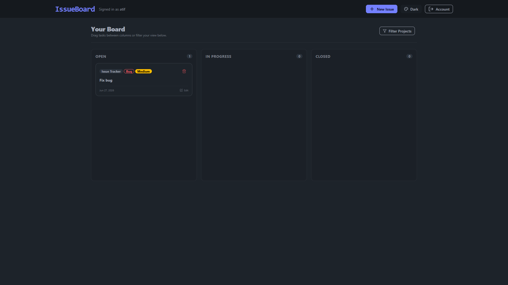

# IssueBoard

A lightweight MERN-stack issue tracker built to learn full-stack development, experiment with modern frontend UI components, and practice core state management patterns.

  

---

### Why I Built This
This is a personal learning project designed to:
* Try out **MERN (MongoDB, Express, React, Node)** stack.
* Explore responsive design using **Tailwind CSS** and **DaisyUI** (including its multi-theme switcher).
* Implement secure, stateless **JWT (JSON Web Token)** authentication with encrypted password hashing.
* Safely deploy a monolithic application architecture to a cloud environment.

---

### Features
* **Full CRUD Board:** Create, read, update, and delete issues.
* **Drag-and-Drop Workflow:** Move cards seamlessly between *Open*, *In Progress*, and *Closed* status columns.
* **Task Prioritization:** Organize tasks by priority (High, Medium, Low) and type (Bug, Feature, Refactor).
* **Multi-Theme Support:** Choose your visual style directly in the navbar using modern DaisyUI themes.
* **Quota Tracking:** Simulates lightweight data metrics by calculating and enforcing a custom byte-storage limit per user.

---

### The Invite Code & Testing Limits

To keep this project lightweight and free for testing, it is hosted on **MongoDB Atlas** and **Render's** free tiers. 

* **Why is there an invite code?** To prevent search engine crawlers and automated spam bots from filling up our database and exhausting the free cloud tier limits.
* **Account Cap:** The application is capped to allow a maximum of **50 active testing accounts**.

#### Want to try it out?
Since GitHub does not support direct messaging, if you would like an invite code to test the application, please:
1. **Open an Issue** on this repository asking for a tester code.
2. Or jsut email me [My Email](atif58136@gmail.com).